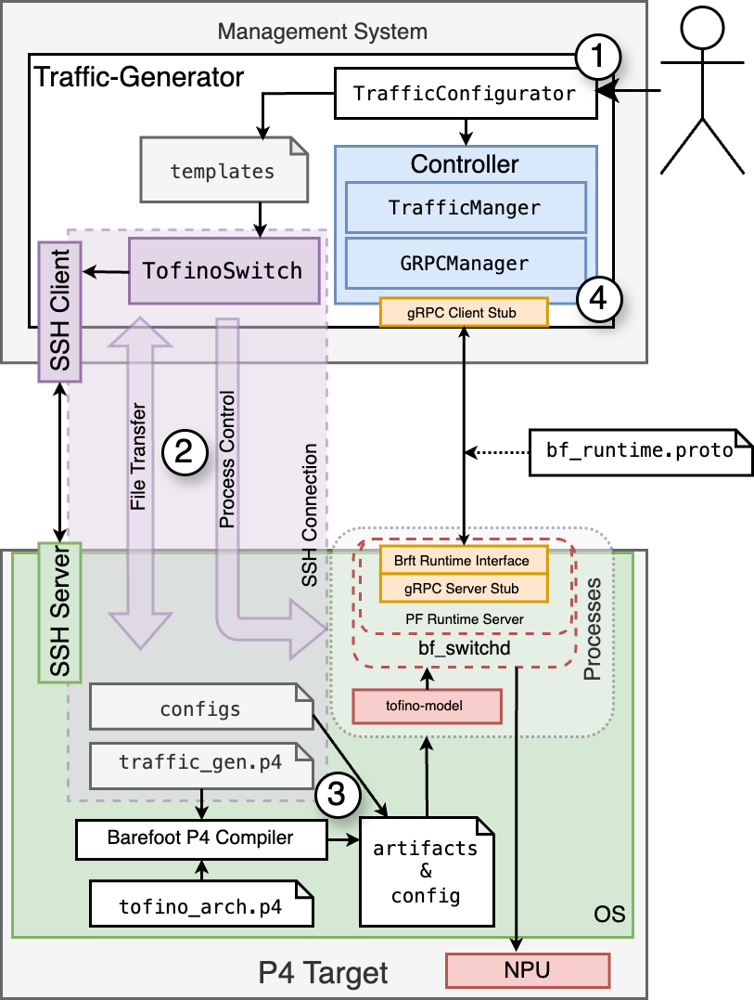

# Tofino Traffic Generator

## Overview

This project provides a Traffic Generator designed specifically for the Intel Tofino family of programmable Ethernet switches. 
The Traffic Generator is capable of generating various types of network traffic to test the performance, security, and resilience of network infrastructures. 
It leverages the flexibility of P4 programming and the advanced capabilities of the Intel Tofino architecture to simulate both typical and malicious network traffic scenarios.

## Features

- **Programmable Forwarding Logic**: Define and customize the forwarding logic using P4.
- **Traffic Generation**: Generate different types of network traffic (TCP SYN Flood, UDP Flood, ICMP Flood, etc.) to simulate DDoS attacks.
- **Flexible Configuration**: Configure traffic parameters such as protocol type, packet size, packet rate, and IP address ranges.
- **Real-Time Monitoring**: Collect metrics and statistics on generated traffic, including packet rate, throughput, and total number of packets.
- **Support for Virtual and Physical Switches**: Run on both Tofino hardware and the Tofino Model for development and testing purposes.

<div align="center">

</div>

## Installation

### Prerequisites

- **Hardware**: Intel Tofino switch or Tofino Model for virtual environments.
- **Software**: 
  - Python 3.8 or higher
  - SDE 9.9.0 or higher
- **Tested on:** MacOS, Ubuntu 20.04 LTS

### Clone the Repository

```bash
git clone https://gitlab.rz.htw-berlin.de/s0558899/tofino-traffic-generator.git
cd tofino-traffic-generator
```

### Install Dependencies (UNIX System)

```bash
# Creates the virtual environment
python3 -m venv .venv
source env/bin/activate
# Install dependencies
pip install .
# Update protobuf definitions
cd tofino-traffic-generator
python post_install.py
```

## Usage

This is a script-based traffic generator, which means you have to program you own test logic. The `tofino-traffic-generator/main.py` provides a rich example of how to use it. 

The following is required for it to work:

- Working SSH connection to P4 target. The credentials for the connection (user, aswell as password or key) have to be provided in the script
- Barefoot Runtime API of P4 target has to be reachable. Make sure you can access this API via the configured port.
- Passwordless sudo or root access to the P4 target

The following example shows the most import step - the configuration of the traffic generator, which in turn defines the desired traffic pattern.

```python
traffic_configuration = TrafficConfigurator(virtual_switch=True)
traffic_configuration.configure_generator(port=68, generation_time_s=15)
traffic_configuration.add_virtual_output_port(1)
traffic_configuration.add_physical_output_port(
    output_physical_port=1, port_speed="25G"
)
traffic_configuration.add_packet_data(
    source_cidr="10.1.1.74/24",
    destination_cidr="10.1.1.5/32",
    eth_src="e8:eb:d3:c1:56:e7",
    eth_dst="e8:eb:d3:c1:56:e5",
    pkt_len=500,
)
traffic_configuration.craft_udp_packet()
traffic_configuration.craft_ipv4_packet()
traffic_configuration.craft_tcp_packet(with_checksum=True)
traffic_configuration.add_throughput(throughput_mbps=1000, mode="port_shaping")
traffic_configuration.generate()
```

## Development Enviroment

The directory `dev_enviroment` contains a Vagrant configuration for the setup of a virtual dev enviroment based on the Tofino-Model.
This is based on the project [tofino-model-vagrant](https://github.com/APS-Networks/tofino-model-vagrant) by APS Networks. The directory contains further information about the setup process. Alternatively check out the tofino-model-vagrant project directly.

## Contributing

Contributions are welcome! Please open an issue or submit a pull request with your changes.

## Acknowledgements

This project is based on the Intel Tofino architecture and uses the P4 programming language. Special thanks to the P4 Language Consortium and the community for their continuous support and development.

Furthermore, this library is inspired by the following projects

- [P4TG](https://github.com/uni-tue-kn/P4TG)
- [PIPO-TG](https://github.com/intrig-unicamp/PIPO-TG)
- [bfrt-helper](https://github.com/APS-Networks/bfrt-helper)
